# SEEKER

# Building a Search Engine from First Principles

**Technical Manuscript — 2026 Edition**

> Build the simple version → discover the bottleneck → replace one component → understand why the advanced structure exists.

---

## About This Book

Seeker is a from-first-principles guide to understanding how a production search engine can be built.

It deliberately starts with simple structures:

- arrays
- hash maps
- sets
- sorted lists
- basic binary trees

Then it progressively introduces:

- inverted indexes
- postings
- BM25
- tries
- finite-state automata
- FSTs
- BlockTree
- KD/BKD trees
- segments
- byte-level formats
- mmap
- distributed shards
- replicas
- cluster management
- production optimization

The goal is not to reproduce Lucene line-for-line.

The goal is to make Lucene and OpenSearch understandable.

---

# Contents

## Part I — Foundations

1. What a Search Engine Actually Does
2. Documents, Fields & Data Types
3. Tokenization, Normalization & Stemming

## Part II — The First Search Engine

4. Inverted Index
5. Postings & Positions
6. Query Execution

## Part III — Relevance

7. Ranking
8. BM25 from First Principles
9. Unknown Words, OOV Terms & Zero-Result Queries

## Part IV — Query Language

10. Text vs Keyword
11. Match, Term, Bool & Range
12. Phrase, Prefix, Wildcard & Regex

## Part V — Fuzzy Search

13. Edit Distance
14. Levenshtein Automata
15. Candidate Terms & Expansion

## Part VI — Term Dictionaries

16. Tries
17. Finite-State Machines
18. FSTs
19. BlockTree

## Part VII — Numeric & Spatial Search

20. Points & Range Indexing
21. KD Trees
22. BKD Trees

## Part VIII — Storage Engine

23. Segments
24. Byte-Level Formats
25. Compression & Checksums
26. mmap & Page Cache

## Part IX — Production Query Engine

27. Query Planning
28. Caching
29. Concurrency & Thread Pools
30. Painless & Scripted Scoring

## Part X — Distributed Search

31. Shards
32. Replicas
33. Distributed Query & Fetch
34. Routing & Rescoring

## Part XI — Cluster & Operations

35. Refresh, Flush & Commit
36. Recovery & Replication
37. Cluster Management

## Part XII — Production Engineering

38. Performance Engineering
39. Capacity Planning
40. Observability & Failure Modes

## Part XIII — The Seeker Project

41. Implementation Roadmap
42. Testing Strategy
43. From Seeker to OpenSearch

---

# Part I — Foundations

# 1. What a Search Engine Actually Does

A search engine has two major jobs:

1. Build structures that make retrieval fast.
2. Use those structures to find and rank documents.

The complete conceptual pipeline is:

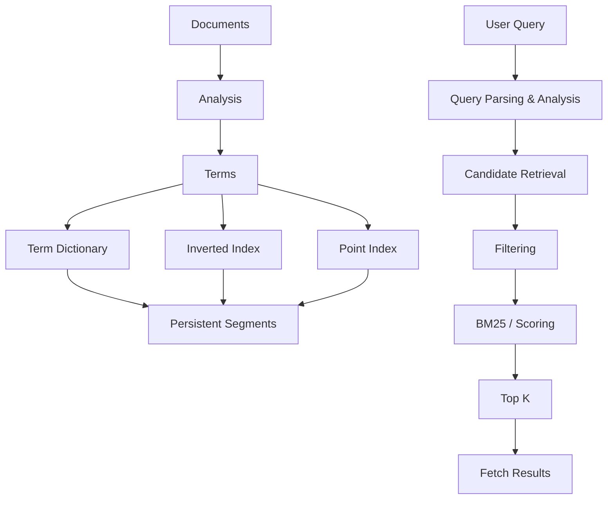

The most important mental model is that there is **not one search data structure**.

Different questions require different structures.

| Question | Structure |
|---|---|
| Does this term exist? | Term dictionary |
| Which documents contain this term? | Postings |
| Where does the term occur? | Positions |
| What terms start with this prefix? | Trie/FST/term dictionary |
| Which terms are within edit distance 1? | Levenshtein automaton + dictionary |
| Which prices are between 100 and 200? | Point index |
| Which geo points are inside a region? | BKD |
| Which matching documents are most relevant? | BM25 |
| How is the index persisted? | Segments/files |
| How is it distributed? | Shards/replicas |

> **FST is not postings. BKD is not a text dictionary. BM25 does not find documents; it scores candidates.**

---

# 2. Documents, Fields & Data Types

A document is a logical record.

A field is a named value inside that document.

Consider:

```json
{
  "title": "Kubernetes Deployment Guide",
  "status": "published",
  "price": 149.99,
  "author_id": "user_123"
}
```

Different fields require different indexing behavior.

| Field | Example | Suitable representation |
|---|---|---|
| title | Kubernetes Deployment Guide | text |
| status | published | keyword |
| author_id | user_123 | keyword |
| price | 149.99 | numeric |
| created_at | 2026-08-13 | date/numeric |
| location | latitude/longitude | point |

## Text

Text is analyzed.

```text
"Kubernetes Deployment Guide"

        |
        v

kubernetes
deployment
guide
```

## Keyword

Keyword is generally stored as one exact value.

```text
"Kubernetes Deployment Guide"

        |
        v

"Kubernetes Deployment Guide"
```

A very useful pattern is a multi-field:

```json
{
  "title": {
    "type": "text",
    "fields": {
      "keyword": {
        "type": "keyword"
      }
    }
  }
}
```

Now the same logical field has two representations:

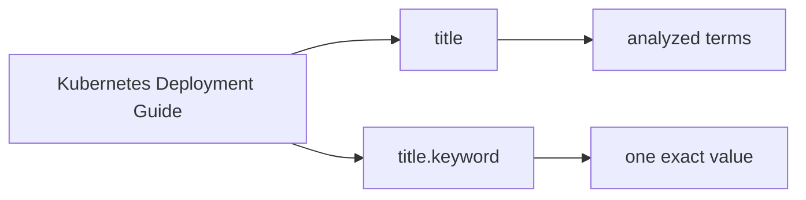

---

# 3. Tokenization, Normalization & Stemming

Before the inverted index sees text, the text must be analyzed.

A simplified analyzer:

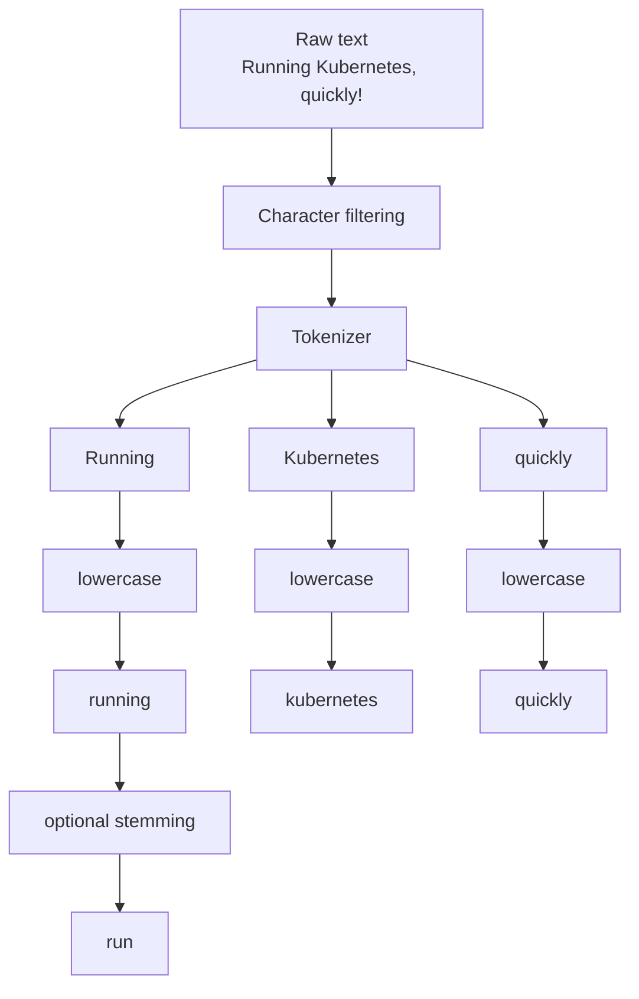

An analyzer conceptually contains:

```text
character filters
        ↓
tokenizer
        ↓
token filters
```

## Token vs Term

A **token** is an intermediate representation.

It can contain:

```text
text
position
start offset
end offset
type
```

A **term** is the searchable value that ultimately participates in the index.

For example:

```text
Raw:
"Running"

Token:
{
    text: "running",
    position: 0,
    start: 0,
    end: 7
}

Indexed term:
"run"
```

The exact behavior depends on the analyzer.

## Index-Time vs Query-Time Analysis

Suppose the index transforms:

```text
running -> run
```

Then the query should normally undergo compatible analysis:

```text
running -> run
```

Otherwise:

```text
index contains: run

query searches: running
```

and the query may miss the indexed representation.

---

# Part II — The First Search Engine

# 4. Inverted Index

The first search engine can be built with a simple map:

```text
term -> set(document IDs)
```

Suppose:

```text
D1 = "I love Kubernetes"

D2 = "Kubernetes is powerful"

D3 = "I love Docker"
```

The index becomes:

```text
i
 └── D1, D3

love
 └── D1, D3

kubernetes
 └── D1, D2

is
 └── D2

powerful
 └── D2

docker
 └── D3
```

In code:

```text
index["kubernetes"] = {D1, D2}
index["love"]       = {D1, D3}
index["docker"]     = {D3}
```

Searching:

```text
kubernetes
```

becomes:

```text
index["kubernetes"]
        |
        v
     D1, D2
```

Instead of:

```text
for every document:
    tokenize
    compare
```

This is the fundamental transformation:

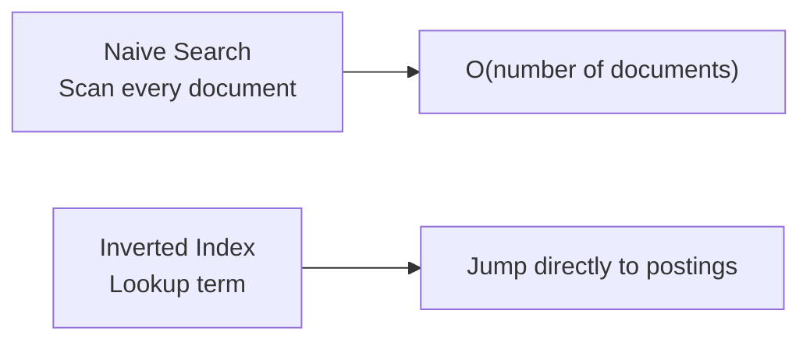

## Boolean Operations

For:

```text
kubernetes AND love
```

we intersect:

```text
kubernetes -> D1, D2
love       -> D1, D3

intersection -> D1
```

For:

```text
kubernetes OR docker
```

we union:

```text
D1, D2
+
D3
=
D1, D2, D3
```

---

# 5. Postings & Positions

A real postings list contains more information than document IDs.

Conceptually:

```text
kubernetes:

D1
  frequency = 1
  positions = [2]

D2
  frequency = 1
  positions = [0]
```

Positions matter for phrase queries.

Consider:

```text
D1 = "Kubernetes deployment guide"

D2 = "Guide about deployment of Kubernetes"
```

Both contain:

```text
kubernetes
deployment
```

But:

```text
D1:
kubernetes  -> position 0
deployment  -> position 1
```

So:

```text
"kubernetes deployment"
```

matches D1 as a phrase.

D2 has:

```text
deployment -> position 2
kubernetes -> position 5
```

So it does not match the exact phrase.

## Postings Compression

Suppose document IDs are:

```text
100
105
110
250
```

Instead store gaps:

```text
100
5
5
140
```

The gaps are usually much smaller.


This becomes important later when we discuss byte-level formats.

---

# 6. Query Execution

A query becomes an execution tree.

For example:

```text
title:kubernetes AND status:published
```

becomes:

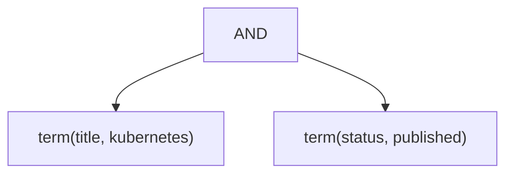

For:

```text
redis OR kafka
```

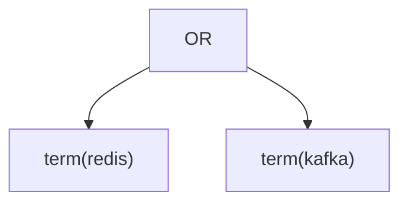

## Sorted Postings Intersection

Suppose:

```text
A = [2, 5, 9, 20]
B = [1, 5, 7, 9]
```

Use two pointers:

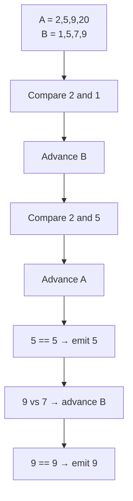

Result:

```text
[5, 9]
```

The production engine should use iterators rather than materializing enormous sets.

---

# Part III — Relevance

# 7. Ranking

Retrieval answers:

> Which documents match?

Ranking answers:

> Which matching documents are most useful?

Consider:

```text
D1 = "Kubernetes deployment guide"

D2 = "Kubernetes deployment deployment deployment"

D3 = "Docker deployment"
```

A query:

```text
"kubernetes deployment"
```

may retrieve D1 and D2.

Now we need to rank them.

Three important signals are:

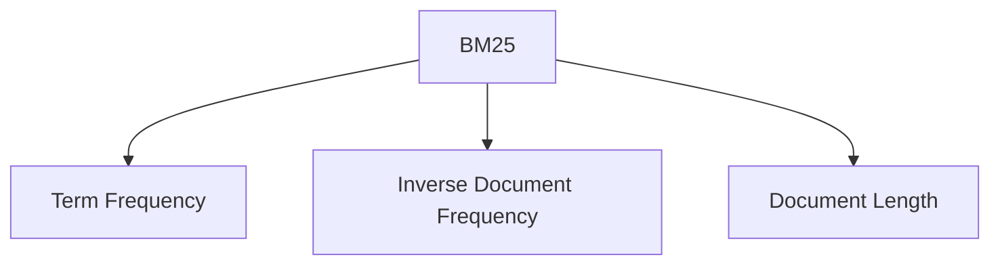

### Term Frequency

More occurrences can indicate relevance.

But:

```text
1 occurrence
2 occurrences
10 occurrences
100 occurrences
```

should not produce a perfectly linear score increase.

BM25 therefore uses saturation.

### Inverse Document Frequency

A term appearing in almost every document is less informative.

```text
common term
    ↓
low information

rare term
    ↓
high information
```

### Document Length

Long documents have more opportunities to contain a term.

Therefore frequency should be normalized by field length.

---

# 8. BM25 from First Principles

BM25 is the ranking algorithm you should understand deeply if you want to understand OpenSearch relevance.

The conceptual pipeline is:


For one query term `t` and document `d`:

```text
score(t,d) =
    IDF(t)
    *
    [ TF(t,d) * (k1 + 1) ]
    /
    [ TF(t,d)
      + k1 * (1 - b + b * |d| / avgdl) ]
```

Where:

```text
TF(t,d) = frequency of term t in document d

|d| = length of the field in document d

avgdl = average field length

k1 = TF saturation parameter

b = document length normalization parameter
```

A common Lucene configuration is:

```text
k1 = 1.2
b  = 0.75
```

## IDF

A common BM25 IDF definition is:

```text
IDF(t) =
ln(
    1 +
    (N - df(t) + 0.5)
    /
    (df(t) + 0.5)
)
```

Where:

```text
N  = number of documents in the field's collection

df = number of documents containing term t
```

## Understanding k1

`k1` controls TF saturation.

Conceptually:

```text
TF contribution

^
|                 ______
|             ___/
|          __/
|       __/
|    __/
|___/____________________> term frequency
```

Increasing frequency helps, but the curve eventually flattens.

## Understanding b

`b` controls document-length normalization.

```text
b = 0
    ↓
ignore length normalization

b = 1
    ↓
full length normalization
```

A common default is:

```text
b = 0.75
```

## BM25 for Multiple Query Terms

For:

```text
"kubernetes deployment"
```

the score is conceptually:

```text
score(document)
 =
 score(kubernetes, document)
 +
 score(deployment, document)
```

So:

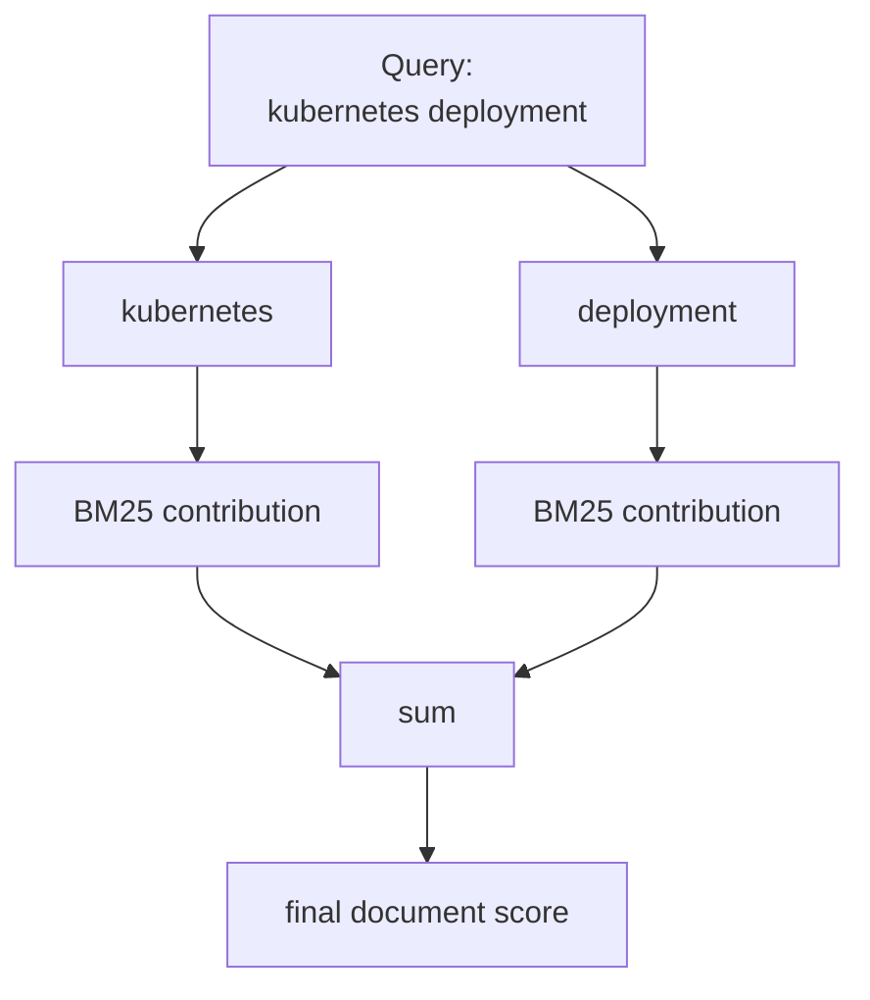

## The Important Mental Model

Do not think:

> BM25 magically knows relevance.

Think:

```text
                 BM25
                   |
        +----------+----------+
        |          |          |
        v          v          v
       TF         IDF      Length
        |          |          |
        v          v          v
 "how often?" "how rare?" "how long?"
        |          |          |
        +----------+----------+
                   |
                   v
            relevance score
```

---

# 9. Unknown Words, OOV Terms & Zero-Result Queries

This is an important edge case.

Suppose the index vocabulary is:

```text
{kubernetes, docker, redis, kafka}
```

The user searches:

```text
terraform
```

After analysis:

```text
terraform
```

Term dictionary lookup:

```text
terraform -> NOT FOUND
```

Therefore:

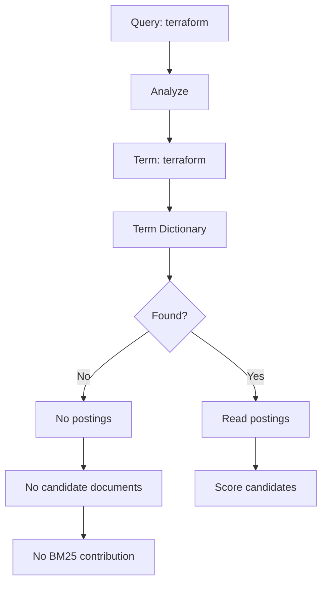

## Does BM25 assign a score to an unknown term?

Practically:

**No document receives a score contribution from that term**, because there is no postings list.

You can mathematically substitute:

```text
df = 0
```

into the IDF formula.

The IDF expression remains finite.

But that does not create matching documents.

The important distinction is:

```text
BM25 scoring
      ↓
requires candidate documents

No postings
      ↓
no candidates
      ↓
nothing to score
```

## Fuzzy Search Can Rescue an OOV Term

Suppose:

```text
indexed term:
kubernetes

query:
kubernets
```

Exact lookup:

```text
kubernets -> NOT FOUND
```

Fuzzy search can find:

```text
kubernetes
```

because the edit distance is within the configured threshold.

---

# Part IV — Query Language

# 10. Text vs Keyword

The distinction is:

```text
text
  ↓
analyzed

keyword
  ↓
not analyzed
```

Example:

```text
"Kubernetes Deployment"
```

Text representation:

```text
kubernetes
deployment
```

Keyword representation:

```text
"Kubernetes Deployment"
```

This leads to:

```text
match → usually full-text/analyzed search

term → exact term lookup
```

But remember:

> `keyword` is a field type. `term` is a query type.

They are related but not the same concept.

---

# 11. Match, Term, Bool & Range

## Match

A match query analyzes the query string.

```text
match:
    "Kubernetes Deployment"

        ↓ analysis

kubernetes
deployment
```

## Term

A term query searches for an exact indexed term.

```text
term:
    "published"

        ↓

exact term lookup
```

## Bool

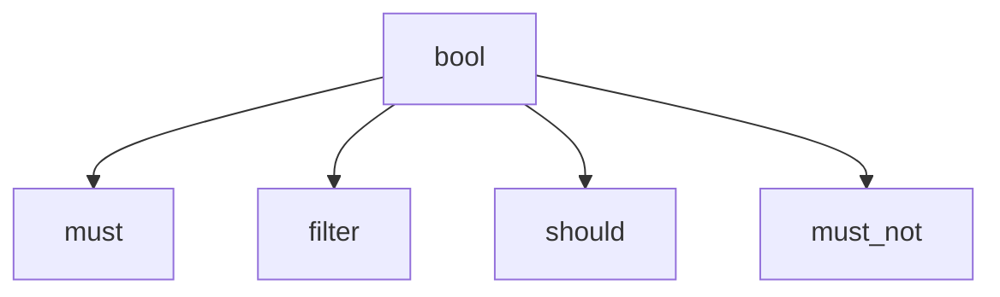

Conceptually:

```text
must
    required

filter
    required but normally not score-oriented

should
    optional/boosting depending on context

must_not
    exclusion
```

## Range

```text
price >= 100
price <= 200
```

This should eventually use a point index.

---

# 12. Phrase, Prefix, Wildcard & Regex

Different query types stress different structures.

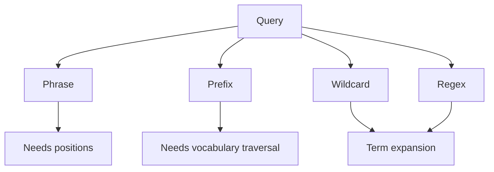

Phrase:

```text
"kubernetes deployment"
```

needs positions.

Prefix:

```text
kube*
```

needs efficient term enumeration.

Wildcard and regex can potentially enumerate a very large portion of the vocabulary.

Therefore:

```text
query expansion
      ↓
must be bounded
```

---

# Part V — Fuzzy Search

# 13. Edit Distance

Levenshtein distance is the minimum number of:

- insertions
- deletions
- substitutions

needed to transform one string into another.

Damerau-Levenshtein additionally considers adjacent transpositions.

Example:

```text
piza
pizza
```

One insertion:

```text
p i z [z] a
        ^
```

Distance:

```text
1
```

A dynamic programming table can calculate this.

```text
dp[i][j]
=
minimum edits to transform
A[0:i] into B[0:j]
```

The recurrence:

```text
if A[i-1] == B[j-1]:

    dp[i][j] = dp[i-1][j-1]

else:

    dp[i][j] =
        1 + min(
            dp[i-1][j],     # delete
            dp[i][j-1],     # insert
            dp[i-1][j-1]    # substitute
        )
```

## First Fuzzy Search Implementation

```text
for every indexed term:

    distance =
        levenshtein(query, term)

    if distance <= max_edits:
        expansion.add(term)

search postings for expansions
```

This is slow.

But it is extremely valuable because it becomes your correctness oracle.

---

# 14. Levenshtein Automata

The problem with brute force:

```text
query
  |
  v
compare against term 1
compare against term 2
compare against term 3
...
compare against millions of terms
```

A Levenshtein automaton changes the problem.

Instead of asking:

> What is the distance between these two known strings?

we build a recognizer for:

> Every string whose distance from this query is <= N.

Conceptually, states track:

```text
(position in query, edits used)
```

Example:

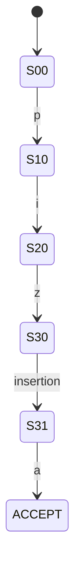

The exact automaton is more complex because substitutions, deletions and insertions create additional transitions.

The key idea is:


The automaton **does not generate English words**.

It recognizes candidate strings.

The term dictionary supplies the actual indexed terms.

---

# 15. Candidate Terms & Expansion

Suppose the vocabulary contains:

```text
kubernetes
kubernets
kubernetes-deployment
kubernetes-service
docker
redis
```

Query:

```text
kubernets~1
```

The engine conceptually performs:

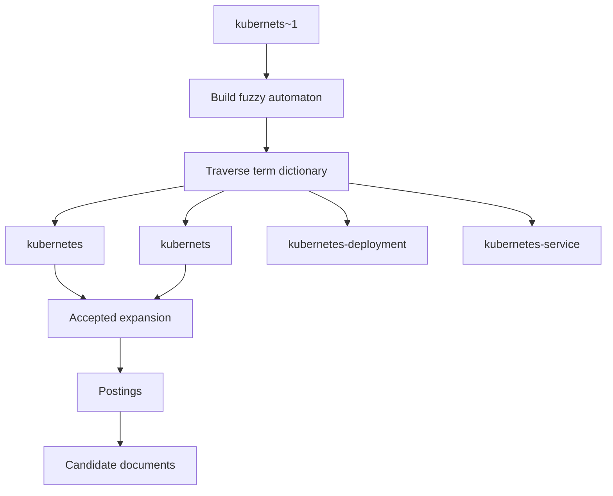

The exact accepted terms depend on edit distance, prefix constraints and query options.

## Prefix Length

Suppose:

```text
prefix_length = 3
query = kubernets
```

Then:

```text
kub
```

must remain fixed.

The engine only explores possible variations after that prefix.

This reduces the search space.

## max_expansions

A fuzzy query can match many terms.

Without a limit:

```text
fuzzy query
   ↓
hundreds/thousands of terms
   ↓
huge Boolean expansion
   ↓
expensive query
```

Therefore production systems provide expansion limits and rewrite strategies.

---

# Part VI — Term Dictionaries

# 16. Tries

A trie stores characters along paths.

For:

```text
car
cat
can
```

we get:

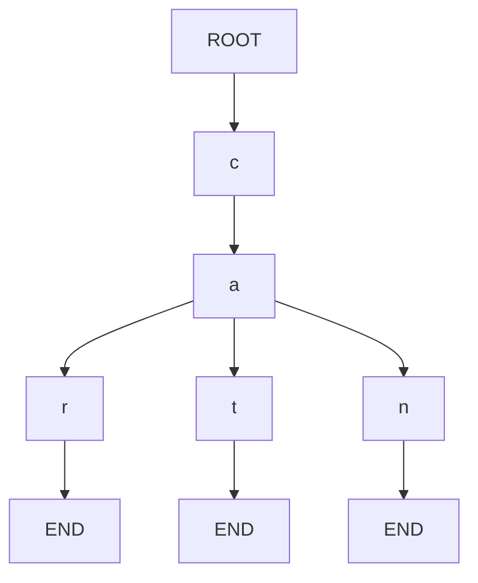

The prefix:

```text
ca
```

is stored once.

## Operations

Exact lookup:

```text
O(length of term)
```

conceptually.

Prefix lookup:

```text
reach prefix
    ↓
enumerate subtree
```

## Why not just use a trie?

A pointer-heavy trie can use substantial memory.

Also:

```text
prefix sharing
```

is not the same as:

```text
suffix/subgraph sharing
```

We can do better.

---

# 17. Finite-State Machines

A finite-state machine is a graph of states and transitions.

For:

```text
car
cat
```

the shared prefix is obvious:

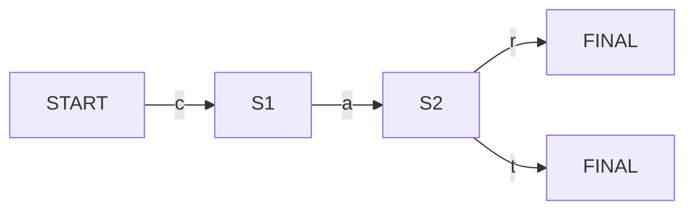

Now consider:

```text
car
bar
```

Both eventually need:

```text
r → END
```

A minimized automaton can share equivalent future behavior.

This is the conceptual transition:

```text
Trie
  ↓
Finite-State Automaton
  ↓
Minimized Automaton
  ↓
FST
```

---

# 18. FSTs

FST means:

> Finite-State Transducer

A normal automaton answers:

```text
input → accept/reject
```

An FST can answer:

```text
input → output
```

For example:

```text
car → 100
cat → 200
can → 300
```

Conceptually:

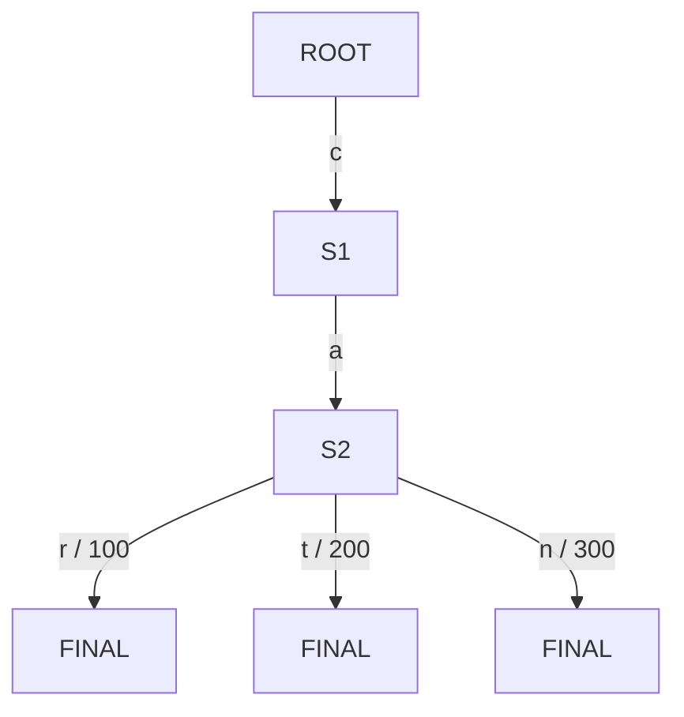

The `/ 100` notation means:

```text
input label = r
output = 100
```

## Why Outputs?

The output can represent something useful such as:

```text
term ordinal
block pointer
metadata
offset
```

depending on how the FST is being used.

## State Sharing

Suppose:

```text
car → 100
bar → 200
```

If the suffix behavior is identical, the graph can share the suffix.

This is where an FST becomes substantially more compact than a naive trie.

## Educational FST Construction

Build it in stages:

```mermaid
flowchart TD
    A["Sorted terms"]
    --> B["Trie"]
    --> C["Process states bottom-up"]
    --> D["Compute state signatures"]
    --> E["Merge identical states"]
    --> F["Attach/factor outputs"]
    --> G["Serialize states + arcs"]
    --> H["FST"]
```

A state signature can conceptually contain:

```text
final output
+
outgoing labels
+
target states
+
arc outputs
```

If two states have the same signature:

```text
state A == state B
```

reuse one state.

---

# 19. BlockTree

Why not store every term directly inside one enormous FST?

A production dictionary can combine:

```text
FST / compact term index
+
term blocks
```

Conceptually:

```mermaid
flowchart TD
    A["Sorted Terms"]
    --> B["Term Blocks"]

    B --> C["Block 1<br/>apple...appstore"]
    B --> D["Block 2<br/>banana...bank"]
    B --> E["Block 3<br/>cluster...cloud"]
    B --> F["Block 4<br/>kubernetes..."]

    G["FST / Prefix Index"]
    --> C
    G --> D
    G --> E
    G --> F
```

The compact index navigates to a relevant region.

The block stores the local terms.

Then:

```text
term
  ↓
term dictionary
  ↓
block
  ↓
term
  ↓
postings
```

This separation is important.

```text
FST
    = navigation

Block
    = local term storage/enumeration

Postings
    = document membership
```

---

# Part VII — Numeric & Spatial Search

# 20. Points & Range Indexing

Text search asks:

```text
Does the document contain this term?
```

Numeric search asks:

```text
Is the value between A and B?
```

Example:

```text
D1 → 10
D2 → 72
D3 → 150
D4 → 201
D5 → 450
```

Query:

```text
100 <= price <= 200
```

Answer:

```text
D3
```

## First Implementation

Sort:

```text
10
72
150
201
450
```

Then binary search:

```mermaid
flowchart LR
    A["Sorted values"] --> B["lower_bound(100)"]
    A --> C["upper_bound(200)"]
    B --> D["value interval"]
    C --> D
    D --> E["matching doc IDs"]
```

This is already much better than scanning every document.

---

# 21. KD Trees

For two-dimensional data:

```text
latitude
longitude
```

we need spatial partitioning.

A KD tree alternates dimensions.

```mermaid
flowchart TD
    A["All Points"] --> B["Latitude < 50"]
    A --> C["Latitude >= 50"]

    B --> D["Longitude < 50"]
    B --> E["Longitude >= 50"]

    C --> F["Longitude < 50"]
    C --> G["Longitude >= 50"]
```

A query rectangle can be compared with each node's region.

```mermaid
flowchart TD
    A["Query Rectangle"] --> B{"Region intersects?"}
    B -->|No| C["Skip subtree"]
    B -->|Yes| D{"Region fully inside?"}
    D -->|Yes| E["Accept/prune"]
    D -->|No| F["Recurse"]
```

The key idea:

> Partition the value space so large regions can be rejected without checking every point.

---

# 22. BKD Trees

BKD is the block-oriented evolution of this idea used by Lucene for point indexing.

Conceptually:

```mermaid
flowchart TD
    A["Point values"] --> B["Encode dimensions as bytes"]
    B --> C["Partition points"]
    C --> D["Internal nodes"]
    D --> E["Leaf blocks"]
    E --> F["Encoded points + doc IDs"]
```

A range query:

```mermaid
flowchart TD
    A["Range Query"] --> B["Root"]
    B --> C{"Query intersects region?"}

    C -->|No| D["Skip entire subtree"]
    C -->|Yes| E["Descend"]

    E --> F["Leaf block"]
    F --> G["Check matching points"]
    G --> H["Doc IDs"]
```

Why **block**?

Instead of representing every point as a heavyweight object:

```text
one point
one object
one node
```

the implementation works with blocks of encoded points.

This is much more suitable for large disk-backed indexes.

---

# Part VIII — Storage Engine

# 23. Segments

The next problem:

> How do we persist the index?

Instead of continuously modifying one giant index, use immutable segments.

```mermaid
flowchart TD
    A["RAM Buffer"]
    --> B["Segment A"]

    A --> C["Segment B"]
    A --> D["Segment C"]

    E["New writes"] --> F["New RAM Buffer"]
    F --> G["Segment D"]

    B --> H["Background Merge"]
    C --> H
    D --> H

    H --> I["Large merged segment"]
```

Segments are useful because:

- readers can search immutable structures
- file formats become stable
- caches can safely retain segment pages
- merges can happen in the background

---

# 24. Byte-Level Formats

Do not serialize language objects and call it a search index.

Define a format.

```text
+----------------------+
| magic bytes          |
| format version       |
| segment ID           |
| metadata             |
+----------------------+
| encoded data         |
| term blocks          |
| postings             |
| points               |
+----------------------+
| checksum             |
| footer               |
+----------------------+
```

## Why Version?

Suppose version 1 stores:

```text
integer = 4 bytes
```

Version 2 stores:

```text
integer = variable length
```

A reader needs to know which format it is reading.

## Offsets

Suppose:

```text
term block #42
    ↓
file offset = 981234
```

The dictionary can store:

```text
prefix → 981234
```

The reader then seeks directly to that location.

---

# 25. Compression & Checksums

Postings are naturally compressible.

Example:

```text
100, 105, 110, 250
```

becomes:

```text
100, 5, 5, 140
```

Term dictionaries also contain redundancy:

```text
kubernetes
kubernetes-deployment
kubernetes-service
```

Shared prefixes can be compressed by tries/FSTs.

## Checksums

Checksums allow the reader to detect corruption.

```mermaid
flowchart LR
    A["Encoded bytes"] --> B["Checksum"]
    B --> C["Stored checksum"]

    D["Read bytes"] --> E["Recalculate"]
    E --> F{"Equal?"}

    F -->|Yes| G["Accept"]
    F -->|No| H["Corruption detected"]
```

Checksums do not provide cryptographic authenticity.

They primarily provide integrity checking.

---

# 26. mmap & Page Cache

Memory mapping lets a process access a file through a virtual memory mapping.

Conceptually:

```mermaid
flowchart TD
    A["Segment file on disk"]
    --> B["mmap"]

    B --> C["Virtual address space"]

    C --> D{"Page already resident?"}

    D -->|Yes| E["CPU reads page"]
    D -->|No| F["Page fault"]
    F --> G["OS loads page"]
    G --> E
```

This means:

```text
The entire index does NOT need to be copied
into application heap memory.
```

Instead:

```text
hot pages
    ↓
RAM

cold pages
    ↓
remain file-backed
```

But mmap is not magic.

Random access can still cause:

- page faults
- disk I/O
- cache misses
- memory pressure

Therefore locality still matters.

---

# Part IX — Production Query Engine

# 27. Query Planning

A search engine is also a small query optimizer.

Suppose:

```text
A → 1,000 matching docs

B → 10,000,000 matching docs
```

Query:

```text
A AND B
```

Drive from A.

```mermaid
flowchart LR
    A["A<br/>1,000 docs"] --> C["Candidate set"]
    B["B<br/>10M docs"] --> C
    C --> D["Check B only for A candidates"]
```

This avoids enormous unnecessary work.

## Top-K

If the user asks for:

```text
top 20
```

do not sort one million results.

Use a bounded heap:

```mermaid
flowchart TD
    A["Candidate"] --> B{"Heap < K?"}
    B -->|Yes| C["Push"]
    B -->|No| D{"Score > minimum?"}
    D -->|Yes| E["Replace minimum"]
    D -->|No| F["Discard"]
```

---

# 28. Caching

Useful cache layers include:

```text
OS page cache
query/result cache
application cache
```

```mermaid
flowchart TD
    A["Search Request"]
    --> B["Query Cache"]

    B -->|Hit| C["Cached Result"]

    B -->|Miss| D["Search Engine"]
    D --> E["OS Page Cache"]
    E --> F["Disk"]

    D --> G["Store reusable result"]
```

A cache should be measured by:

- hit rate
- miss rate
- eviction rate
- memory consumption
- latency improvement

---

# 29. Concurrency & Thread Pools

Search can run over multiple segments in parallel.

```mermaid
flowchart TD
    A["Search Request"]
    --> B["Worker Pool"]

    B --> C["Segment A"]
    B --> D["Segment B"]
    B --> E["Segment C"]

    C --> F["Top K"]
    D --> F
    E --> F

    F --> G["Merge"]
```

But unlimited concurrency is dangerous.

Too many workers cause:

```text
context switching
memory pressure
CPU contention
I/O contention
queueing
```

Therefore:

```text
bounded workers
+
bounded queues
+
timeouts
+
backpressure
```

---

# 30. Painless & Scripted Scoring

Painless is OpenSearch's scripting language.

A script can apply custom business logic.

```mermaid
flowchart TD
    A["Index retrieval"] --> B["Candidate documents"]
    B --> C["Base score"]
    C --> D["Painless"]
    D --> E["rating"]
    D --> F["popularity"]
    D --> G["business rule"]
    E --> H["Final score"]
    F --> H
    G --> H
```

A good pattern is:

```text
cheap index retrieval
        ↓
small candidate set
        ↓
expensive script
```

Avoid:

```text
millions of candidates
        ↓
expensive script
        ↓
slow query
```

---

# Part X — Distributed Search

# 31. Shards

One index can be partitioned:

```mermaid
flowchart TD
    A["Logical Index"]
    --> B["Shard 0"]
    A --> C["Shard 1"]
    A --> D["Shard 2"]

    B --> E["Segments"]
    C --> F["Segments"]
    D --> G["Segments"]
```

Each shard is essentially its own search index.

Sharding provides:

- more total storage
- parallel indexing
- parallel search
- failure isolation

But it introduces:

- fan-out
- coordination
- more caches
- more segment sets
- more cluster metadata

---

# 32. Replicas

Replication copies a shard.

```mermaid
flowchart LR
    A["Primary Shard 0"] --> B["Replica Shard 0"]
    C["Primary Shard 1"] --> D["Replica Shard 1"]
```

Sharding:

```text
split data
```

Replication:

```text
copy data
```

Replica benefits:

- failure tolerance
- read capacity
- maintenance flexibility

Costs:

- disk
- replication traffic
- indexing work
- cluster state

---

# 33. Distributed Query & Fetch

A client request can become:

```mermaid
sequenceDiagram
    participant C as Client
    participant N as Coordinator
    participant S1 as Shard 1
    participant S2 as Shard 2
    participant S3 as Shard 3

    C->>N: Search
    N->>S1: Query
    N->>S2: Query
    N->>S3: Query

    S1-->>N: Top K candidates
    S2-->>N: Top K candidates
    S3-->>N: Top K candidates

    N->>N: Global merge
    N->>S1: Fetch winners
    N->>S2: Fetch winners

    S1-->>N: Documents
    S2-->>N: Documents

    N-->>C: Final results
```

Why separate query and fetch?

Because scoring thousands of candidates does not require fetching the complete `_source` for all of them.

---

# 34. Routing & Rescoring

Routing:

```mermaid
flowchart LR
    A["Routing Key"] --> B["Hash"]
    B --> C["Shard Number"]
```

Routing can colocate related documents.

But poor routing can create:

```text
hot shard
```

## Rescoring

A common architecture:

```mermaid
flowchart TD
    A["Cheap retrieval"] --> B["Top 500"]
    B --> C["Expensive scorer"]
    C --> D["Top 20"]
```

This allows expensive logic only where it can change the final result.

---

# Part XI — Cluster & Operations

# 35. Refresh, Flush & Commit

These concepts should not be confused.

```mermaid
flowchart TD
    A["New writes"] --> B["RAM buffer"]

    B --> C["Refresh"]
    C --> D["Search visibility"]

    B --> E["Flush"]
    E --> F["Segment files"]

    F --> G["Commit"]
    G --> H["Durable reopenable state"]
```

### Refresh

Makes recent writes visible to search.

### Flush

Writes buffered index work into segment files.

### Commit

Creates a durable reopenable index state.

The exact implementation details depend on the search engine/version.

---

# 36. Recovery & Replication

Failure is part of the architecture.

Possible failures:

```text
process crash
node loss
disk corruption
network partition
replica lag
cluster-state inconsistency
```

Recovery flow:

```mermaid
flowchart TD
    A["Failure"] --> B["Detect missing shard"]
    B --> C["Find valid copy"]
    C --> D["Recover shard"]
    D --> E["Verify segments/checksums"]
    E --> F["Mark healthy"]
```

A production engine must test this path.

---

# 37. Cluster Management

The control plane maintains information such as:

```mermaid
flowchart TD
    A["Cluster State"]
    --> B["Nodes"]
    A --> C["Shard Assignments"]
    A --> D["Index Metadata"]
    A --> E["Replica State"]
    A --> F["Mappings / Settings"]
```

Separate:

```text
CONTROL PLANE
    |
    +-- node membership
    +-- shard allocation
    +-- metadata
    +-- recovery

DATA PLANE
    |
    +-- indexing
    +-- searching
    +-- scoring
    +-- fetching
```

This is a distributed-systems problem layered on top of the search engine.

---

# Part XII — Production Engineering

# 38. Performance Engineering

Optimize in this order:

```mermaid
flowchart TD
    A["Correctness"]
    --> B["Algorithmic complexity"]
    --> C["Data structure"]
    --> D["Memory layout"]
    --> E["CPU/cache behavior"]
    --> F["Disk I/O"]
    --> G["Concurrency"]
    --> H["Distributed coordination"]
```

Measure:

- p50
- p95
- p99
- CPU
- heap
- GC
- page faults
- disk latency
- query fan-out
- candidate count
- cache hit rate
- segment count
- merge pressure
- shard skew

Common symptoms:

| Symptom | Investigation |
|---|---|
| High p99 | I/O, GC, queueing, hot shard |
| High CPU | scoring, scripts, expansions |
| High disk I/O | poor locality, cold cache |
| Memory pressure | caches, segments, working set |
| Uneven nodes | hot shards/routing |

---

# 39. Capacity Planning

Start with the data:

```text
documents/sec
average document size
unique term count
average field length
point count
retention
```

Then workload:

```text
QPS
query mix
candidate count
top-K
read/write ratio
peak traffic
freshness target
```

Conceptually:

```text
logical index size
    ≈ documents × bytes/indexed-document

cluster storage
    ≈ logical size × replica factor
      + merge headroom
      + recovery headroom
      + snapshot headroom
      + growth
```

Never size a search cluster using raw source-document size alone.

---

# 40. Observability & Failure Modes

## Index Metrics

```text
documents indexed/sec
refresh latency
flush latency
commit latency
merge throughput
segment count
rejected writes
```

## Search Metrics

```text
query latency
candidate count
cache hit rate
script latency
timeouts
partial failures
shard fan-out
```

## Correctness Tests

Keep a reference implementation.

```mermaid
flowchart LR
    A["Query"] --> B["Reference Engine"]
    A --> C["Optimized Engine"]

    B --> D["Expected Result"]
    C --> E["Actual Result"]

    D --> F{"Equal?"}
    E --> F

    F -->|Yes| G["Correct"]
    F -->|No| H["Investigate"]
```

This is especially powerful for:

- fuzzy search
- postings compression
- FST
- BKD
- query optimizations

---

# Part XIII — The Seeker Project

# 41. Implementation Roadmap

Build the engine in stages.

| Stage | Build | Replace later with |
|---|---|---|
| 1 | documents + tokenizer | real analyzer |
| 2 | term → set(docID) | compressed postings |
| 3 | positions | position codecs |
| 4 | AND/OR/phrase | iterator execution |
| 5 | toy score | BM25 |
| 6 | sorted terms | trie |
| 7 | trie | minimized automaton |
| 8 | automaton + outputs | FST |
| 9 | term blocks | BlockTree-style dictionary |
| 10 | sorted numeric values | BKD |
| 11 | simple files | versioned segment codec |
| 12 | file reads | mmap reader |
| 13 | single node | shards |
| 14 | shards | replicas/recovery |
| 15 | basic metrics | production observability |

The important rule:

> Do not skip an intermediate structure merely because you already know the name of the final structure.

Experience the problem first.

---

# 42. Testing Strategy

## Golden Corpus

Start with:

```text
D1 = "kubernetes deployment"

D2 = "docker deployment"

D3 = "kubernetes service"
```

Expected:

```text
kubernetes
    -> D1, D3

deployment
    -> D1, D2

kubernetes AND service
    -> D3

"kubernetes deployment"
    -> D1
```

## Differential Testing

Use a slow implementation as the oracle.

For fuzzy search:

```text
Reference:
brute-force edit distance

Optimized:
automaton + FST
```

Compare:

```mermaid
flowchart LR
    A["Same Query"] --> B["Brute Force"]
    A --> C["Optimized"]

    B --> D["Expected Terms"]
    C --> E["Actual Terms"]

    D --> F{"Same?"}
    E --> F
```

For range queries:

```text
Reference = full scan

Optimized = BKD
```

For postings:

```text
Reference = HashSet

Optimized = compressed iterator
```

---

# 43. From Seeker to OpenSearch

The mental mapping is:

| Seeker | Lucene/OpenSearch |
|---|---|
| Analyzer | analysis chain |
| term → docs | postings |
| sorted terms | term dictionary |
| trie/automaton | FST/term index |
| term blocks | BlockTree |
| point tree | BKD |
| segment | Lucene segment |
| BM25 | BM25Similarity |
| match/term/bool | Query DSL |
| fuzzy | FuzzyQuery/fuzzy query |
| script | Painless |
| shards | distributed partitions |
| replicas | shard copies |

The complete architecture:

```mermaid
flowchart TD
    A["DOCUMENT"] --> B["ANALYZER"]

    B --> C["TERMS"]

    C --> D["TEXT INDEX"]
    C --> E["POINT INDEX"]

    D --> F["FST / BlockTree"]
    F --> G["POSTINGS"]

    E --> H["BKD"]

    G --> I["QUERY ENGINE"]
    H --> I

    I --> J["FILTER"]
    J --> K["BM25 / SCORING"]
    K --> L["TOP K"]
    L --> M["FETCH"]

    M --> N["SHARD MERGE"]
    N --> O["FINAL RESPONSE"]
```

---

# Appendix A — BM25 Worked Example

Suppose:

```text
D1 = "kubernetes kubernetes deployment"

D2 = "kubernetes deployment"

D3 = "docker deployment"
```

For:

```text
term = kubernetes
```

we have:

```text
N = 3
df = 2

D1:
TF = 2
length = 3

D2:
TF = 1
length = 2

D3:
TF = 0
length = 2
```

Average field length:

```text
avgdl = (3 + 2 + 2) / 3
      = 7 / 3
      ≈ 2.333
```

IDF:

```text
IDF =
ln(
    1 +
    (3 - 2 + 0.5) /
    (2 + 0.5)
)

= ln(1 + 1.5 / 2.5)

= ln(1.6)
```

D1 has:

```text
TF = 2
```

D2 has:

```text
TF = 1
```

D3 has:

```text
TF = 0
```

Therefore D3 gets no contribution from this term.

The important thing is not memorizing the final decimal.

The important thing is understanding:

```text
TF
+
IDF
+
length normalization
+
TF saturation
=
BM25
```

---

# Appendix B — FST Construction

Educational construction:

```mermaid
flowchart TD
    A["Sorted Keys"]
    --> B["Build Trie"]
    --> C["Process Leaves Upward"]
    --> D["Compute State Signatures"]
    --> E["Merge Equivalent States"]
    --> F["Attach / Factor Outputs"]
    --> G["Serialize"]
    --> H["FST"]
```

Toy state signature:

```text
final output

outgoing:
    label
    target state
    arc output
```

Equivalent signatures can share a state.

Production Lucene adds considerably more engineering around:

- compact byte storage
- arc encoding
- outputs
- final-state handling
- random access
- iteration
- memory layout

---

# Appendix C — BKD Construction

Educational 1D version:

```text
points = [
    (10, D1),
    (20, D2),
    (30, D3),
    ...
]
```

Sort by value.

Choose a split.

```mermaid
flowchart TD
    A["All points"] --> B["Choose split"]
    B --> C["Left partition"]
    B --> D["Right partition"]
    C --> E["Recurse"]
    D --> F["Recurse"]
```

Stop when:

```text
leaf_size <= threshold
```

For 2D:

```text
depth 0 → latitude
depth 1 → longitude
depth 2 → latitude
...
```

Production BKD adds:

- byte-space encoding
- balanced partitioning
- block leaves
- metadata
- optimized traversal
- disk-oriented writing

---

# Appendix D — Minimal Seeker API

A useful architecture could expose:

```text
interface Engine {

    Index(document)

    Delete(documentID)

    Refresh()

    Search(query, topK)

    Commit()

    Open(path)
}
```

Analyzer:

```text
interface Analyzer {

    Analyze(text)
        -> tokens
}
```

Query:

```text
interface Query {

    Execute(reader)
        -> scorer
}
```

Scorer:

```text
interface Scorer {

    Next()
    DocID()
    Score()
}
```

The important abstraction is:

```mermaid
flowchart LR
    A["Query"] --> B["Index Reader"]
    B --> C["Scorer"]
    C --> D["Doc ID"]
    C --> E["Score"]
```

The query should not care whether the postings came from:

```text
HashMap
compressed file
mmap
remote shard
```

That is what makes the architecture extensible.

---

# Appendix E — Production Checklist

- Define freshness guarantees.
- Define durability guarantees.
- Bound fuzzy expansion.
- Bound wildcard/regex expansion.
- Set distributed timeouts.
- Monitor p50/p95/p99.
- Track shard sizes.
- Track shard skew.
- Test node failures.
- Test disk failures.
- Test network failures.
- Test recovery.
- Test snapshot/restore.
- Monitor segment counts.
- Monitor merge pressure.
- Keep index formats versioned.
- Verify checksums.
- Keep a reference implementation.
- Differential-test optimized algorithms.
- Load-test realistic query distributions.
- Version analyzers and mappings carefully.
- Treat reindexing as a data migration.
- Protect expensive scripts.

---

# The Seeker Principle

> **When a search engine feels magical, find the question it is answering and identify the data structure responsible for that question.**

Terms lead to dictionaries.

Documents lead to postings.

Numeric values lead to point indexes.

Relevance leads to scoring.

Durability leads to segments and files.

Distribution leads to shards and replicas.

Build the simple version first.

Then make it fast.

---

# References & Further Reading

Use the official documentation for implementation-specific behavior and version changes.

- Apache Lucene — official documentation and core APIs.
- Lucene `BM25Similarity` — BM25 formula, IDF, `k1`, `b`, norms and field statistics.
- Lucene FST — finite-state transducers, arcs, outputs and compact representation.
- Lucene BKDReader/BKDWriter — block KD-tree point indexing.
- OpenSearch Text Analysis — analyzers, tokenizers and token filters.
- OpenSearch Field Types — text, keyword and numeric fields.
- OpenSearch Query DSL — full-text, term-level, fuzzy and range queries.
- OpenSearch cluster documentation — shards, replicas and distributed operations.

Official sites:

- https://lucene.apache.org/
- https://docs.opensearch.org/

---

**SEEKER — Building a Search Engine from First Principles**

**Technical manuscript • 2026**
